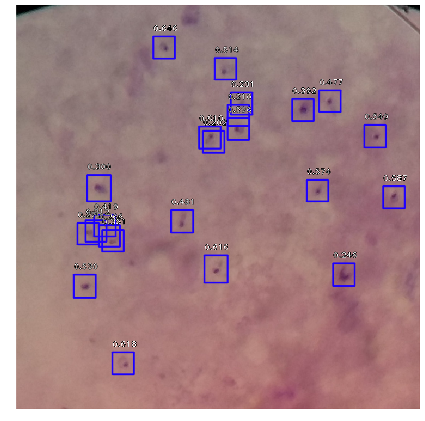
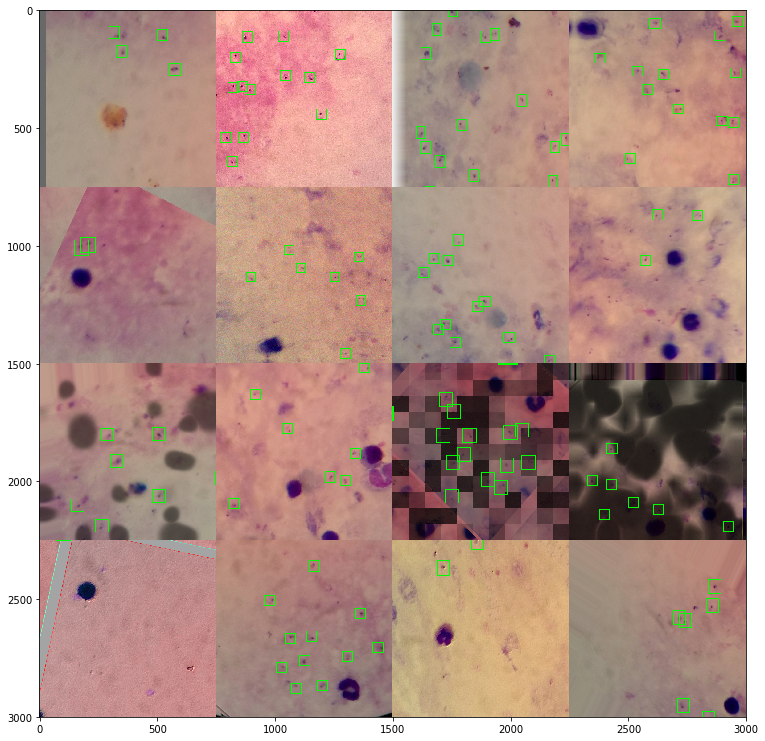

### AiScope
http://aiscope.net/

------------------

Detecting malaria parasites in thick blood samples using retinanet object detection architecture
https://arxiv.org/abs/1708.02002

### Setup

This package requires
- https://github.com/i008/detdata
- https://github.com/i008/keras-retinanet

Install in develop mode:
```bash
python setup.py develop
```

### Inference

Check the ./notebooks directory for examples how to predict and train the detector


### Example (inference)
<!--  -->


### Augmentation

Augmentation is done in detdata using the amazing imgaug package (https://github.com/aleju/imgaug)

<!--  -->

### Run the demo (docker required)

To test on other images - place them in the testimages folder.

```bash
git clone https://github.com/i008/aiscope.git && cd aiscope

# run the container
sudo docker run -p 7777:7777 \
-v $PWD/testimages:/opt/aiscope/images \
-t i008/aiscope:latest jupyter notebook \
--no-browser \
--port 7777 \
--allow-root \
--ip=0.0.0.0 \
--NotebookApp.token=''

#go to localhost:7777
#open, run, play with demo.ipynb

```
